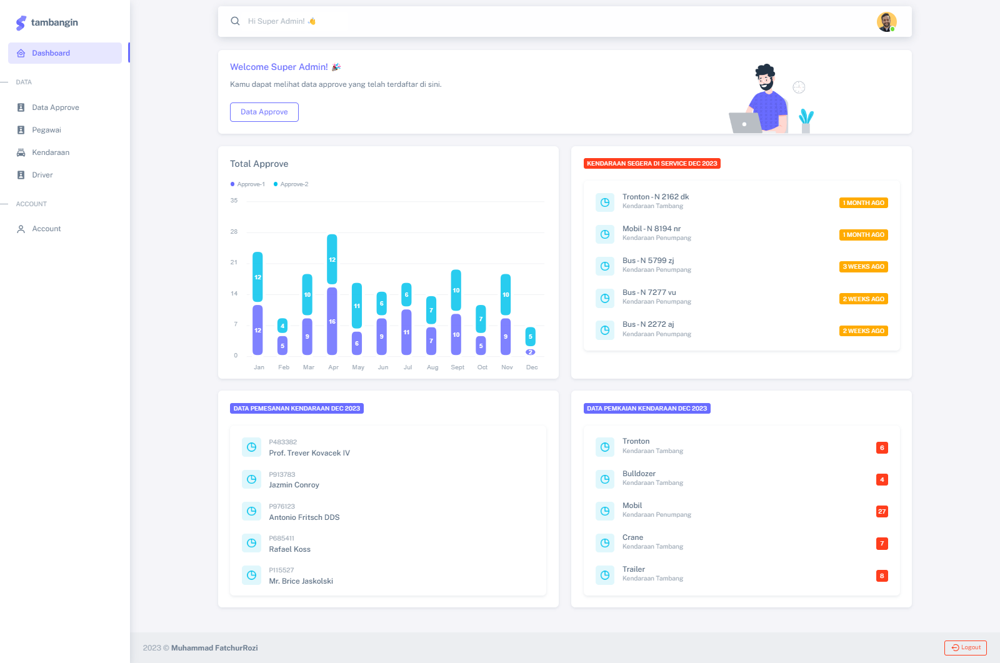

## Note

-   **Semua Proses Bisa Dilakukan Di Dev, Tanpa Harus Login ke Akun Lain**
-   **Database Version : XAMPP 8.2.4**
-   **PHP Version : 8.2.4**
-   **Laravel Framework 10.35.0**
-   **[Physical Data Model](https://lucid.app/lucidchart/50004984-2591-491e-a216-00c33ad2e28a/edit?viewport_loc=-1792%2C-890%2C4797%2C2173%2C0_0&invitationId=inv_9f003431-e768-4513-8c6b-f08af47a6136)**
-   **[Activity Diagram](https://lucid.app/lucidchart/cfd306f4-f34a-4849-9752-ea4f17ebab91/edit?viewport_loc=340%2C-515%2C2325%2C1053%2C0_0&invitationId=inv_c2db4767-560e-4aaf-830c-583ebdd9bf1a)**

# Local Installation

-   run `git clone https://https://github.com/MuhammadFatchurRozi/tambangin.git`
-   run `composer install `
-   copy .env.example to .env
-   run `cp .env.example .env`
-   run `php artisan key:generate`
-   set up your database in the .env
-   run `php artisan migrate --seed`
-   run `php artisan serve`
-   then visit `http://localhost:8000 or http://127.0.0.1:8000`.

# Account

> Email: dev@dev.com || Password: dev12345
> Email: admin@gmail.com || Password: 12345678
> Email: kepalaKantor@gmail.com || Password: 12345678
> Email: pool@gmail.com || Password: 12345678
> Email: service@gmail.com || Password: 12345678

## Demo

